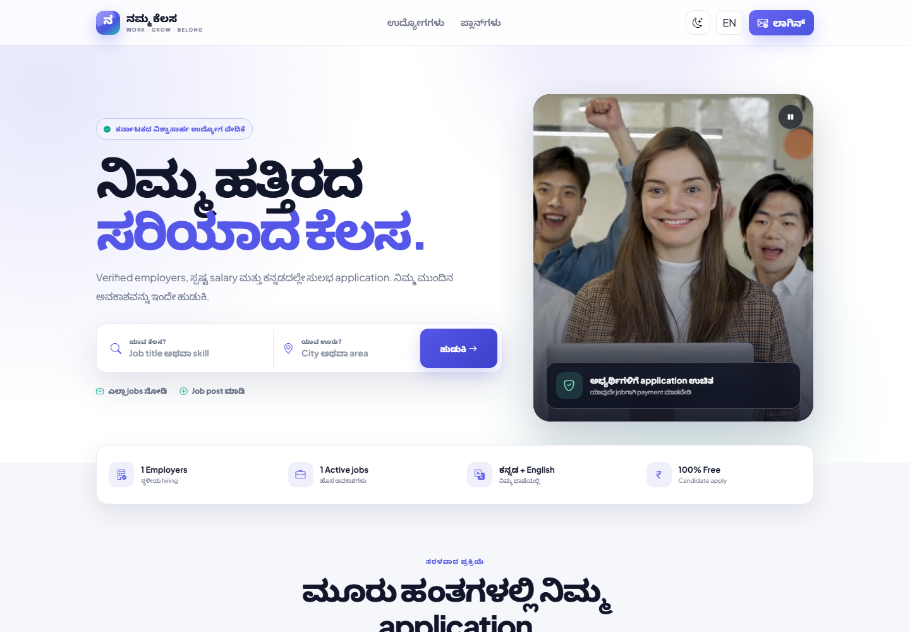
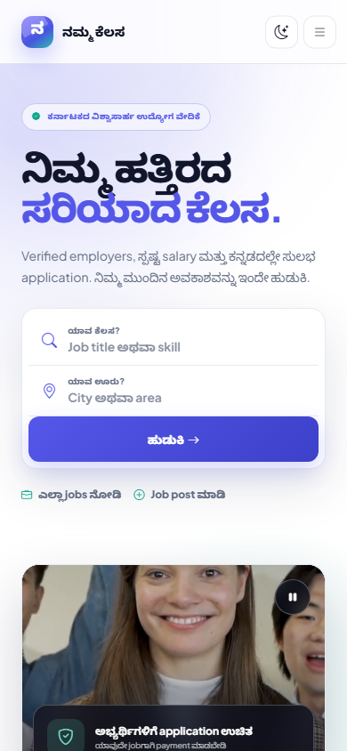
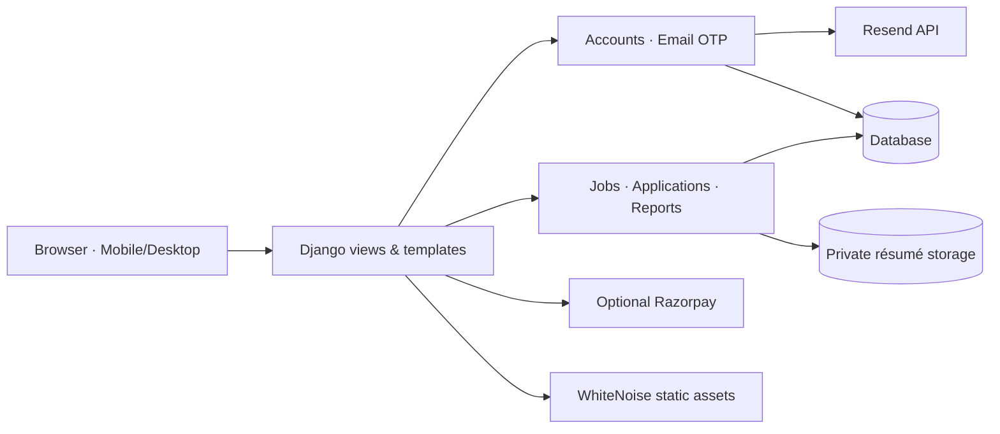

<div align="center">

# 💼 Namma Kelasa · ನಮ್ಮ ಕೆಲಸ

### Karnataka's bilingual, candidate-first local jobs platform

Find verified local opportunities, apply with a reusable résumé, and manage hiring—all in Kannada or English.

[](https://github.com/hanu7348/namma-kelasa/actions/workflows/ci.yml)


[Features](#-features) · [Screenshots](#-screenshots) · [Quick start](#-quick-start) · [Configuration](#-configuration) · [Contributing](#-contributing)

</div>

---

## ✨ Overview

Namma Kelasa is a full-stack Django marketplace designed to make local employment easier and safer across Karnataka. It supports passwordless email authentication, bilingual discovery, reusable private résumés, employer workflows, application tracking, moderation, scam reporting, and optional Razorpay subscriptions.

The interface uses self-hosted Bootstrap 5.3, Bootstrap Icons, scoped Tailwind utilities, custom design tokens, persistent light/dark themes, and responsive media built for desktop and mobile.

## 📸 Screenshots

### Desktop



<div align="center">

### Mobile · 390 px



</div>

## 🚀 Features

| Area | Capabilities |
|---|---|
| 🔐 Authentication | Passwordless email OTP, hashed OTP storage, expiry, attempt limits, rate limiting, rolling sessions |
| 👤 Job seekers | Bilingual profile, private PDF/DOC/DOCX résumé, one-click applications, status dashboard |
| 🏢 Employers | Company profile, job publishing, applicant review, résumé access controls, status management |
| 🔎 Discovery | Kannada/English jobs, category filters, location search, salary visibility, featured listings |
| 🛡️ Trust & safety | Verified employer badges, scam reports, candidate-fee warnings, admin moderation |
| 💳 Payments | Optional Razorpay subscription checkout and signed webhook validation |
| ✉️ Email | Official Resend Python SDK with configurable sender domain |
| 🎨 Interface | Bootstrap 5.3, responsive layouts, light/dark modes, reduced-motion support, optimized video |
| 🌐 Localisation | Kannada-first default with an English switcher |
| 🧪 Quality | Django system checks, migration checks, 16 automated tests, GitHub Actions CI |

## 👥 User roles

### Job seeker

- Search jobs by skill, category, city, and employment type.
- Maintain one reusable private résumé, up to 5 MB.
- Apply from mobile and monitor each application status.
- Download or replace the résumé from the account dashboard.

### Employer

- Maintain company and verification information.
- Publish, edit, close, and feature job listings.
- Review applicants and download only résumés submitted to owned jobs.
- Move applications through review, shortlist, rejection, and hire states.

### Administrator

- Verify employers and moderate listings.
- Review scam reports and payment records.
- Manage users, applications, categories, subscriptions, and site content.

## 🧭 Architecture



## 🛠️ Technology

- **Backend:** Python, Django 4.2, Gunicorn
- **Authentication:** custom email user model and Resend OTP
- **Frontend:** Django templates, Bootstrap 5.3, Bootstrap Icons, scoped Tailwind CSS
- **Static delivery:** WhiteNoise
- **Development database:** SQLite
- **Payments:** Razorpay-compatible server integration
- **CI:** GitHub Actions on Python 3.9 and 3.12

## ⚡ Quick start

### Windows PowerShell

```powershell
git clone https://github.com/hanu7348/namma-kelasa.git
Set-Location namma-kelasa

python -m venv .venv
.venv\Scripts\Activate.ps1
python -m pip install --upgrade pip
python -m pip install -r requirements.txt

npm install
npm run build

Copy-Item .env.example .env
python manage.py migrate
python manage.py createsuperuser
python manage.py runserver
```

Open <http://127.0.0.1:8000/>.

For optional local sample content:

```powershell
python manage.py seed_demo
```

The command is intentionally blocked when `DJANGO_DEBUG=False`.

## ⚙️ Configuration

Copy `.env.example` to `.env` and configure only the services you use.

| Variable | Purpose | Development default |
|---|---|---|
| `DJANGO_SECRET_KEY` | Cryptographic signing secret | Change before production |
| `DJANGO_DEBUG` | Django debug mode | `True` |
| `DJANGO_ALLOWED_HOSTS` | Comma-separated hosts | `127.0.0.1,localhost` |
| `DJANGO_CSRF_TRUSTED_ORIGINS` | HTTPS origins for deployed forms | Empty |
| `SITE_URL` | Canonical application URL | `http://127.0.0.1:8000` |
| `DEFAULT_LANGUAGE` | `kn` or `en` | `kn` |
| `SESSION_COOKIE_AGE_DAYS` | Rolling login-session lifetime | `30` |
| `OTP_BACKEND` | `console` or `resend` | `console` |
| `OTP_TTL_MINUTES` | OTP validity period | `5` |
| `RESEND_API_KEY` | Resend secret API key | Empty |
| `RESEND_FROM_EMAIL` | Verified sender identity | Resend test sender |
| `RAZORPAY_KEY_ID` | Razorpay public key | Empty |
| `RAZORPAY_KEY_SECRET` | Razorpay secret key | Empty |
| `RAZORPAY_WEBHOOK_SECRET` | Webhook signature secret | Empty |

> [!CAUTION]
> Never commit `.env`, API keys, SQLite databases, uploaded résumés, private media, logs, or production exports. Rotate any credential previously shared through chat, screenshots, or logs.

## ✉️ Resend email OTP

For development, keep `OTP_BACKEND=console`. For real email delivery:

```dotenv
OTP_BACKEND=resend
RESEND_API_KEY=your_new_resend_key
RESEND_FROM_EMAIL=Namma Kelasa <login@your-verified-domain.example>
```

Resend's `onboarding@resend.dev` sender is limited to permitted test recipients. Verify your sending domain and configure SPF/DKIM before public launch.

OTP codes are stored as password hashes, expire after five minutes by default, allow limited verification attempts, and are request-rate-limited. Returning users keep a rolling browser session until logout or expiry.

## 📄 Private résumé handling

Résumés are stored outside public media and are never exposed as direct static URLs. The server streams a file only when the authenticated requester is:

- the résumé owner; or
- the employer who owns a job to which that résumé was submitted.

Allowed formats are PDF, DOC, and DOCX, with a 5 MB limit.

## 💳 Razorpay

Set Razorpay variables in `.env`, use test keys first, and configure:

```text
https://your-domain.example/payments/webhook/razorpay/
```

Subscribe to `payment.captured`. Webhook payloads are verified with HMAC before processing.

## ✅ Verification

```powershell
python manage.py check
python manage.py makemigrations --check --dry-run
python manage.py collectstatic --noinput
python manage.py test
```

GitHub Actions runs the same checks against Python 3.9 and 3.12 for every pull request and every push to `main`.

## 🌍 Production deployment

The repository includes a `Procfile` for WSGI platforms:

```text
web: gunicorn nammakelasa.wsgi:application
```

Recommended production steps:

1. Set `DJANGO_DEBUG=False` and generate a strong `DJANGO_SECRET_KEY`.
2. Configure allowed hosts, trusted HTTPS origins, and `SITE_URL`.
3. Replace SQLite with a managed PostgreSQL service before accepting real users.
4. Run migrations and `collectstatic` during deployment.
5. Use persistent private object storage for uploaded résumés.
6. Verify the Resend domain and rotate all development credentials.
7. Enable HTTPS, backups, structured logging, monitoring, and abuse alerts.
8. Obtain qualified review of privacy, terms, refunds, employer verification, and applicable employment-platform obligations.

> GitHub Pages cannot execute Django. This repository hosts the source code; deploy the web application to a Python-capable platform such as Render, Railway, Fly.io, or a VPS.

## 🗂️ Project structure

```text
accounts/                     Email users, OTP, profile and private résumé logic
jobs/                         Listings, applications, reports, plans and payments
nammakelasa/                  Django settings, URLs, middleware, ASGI and WSGI
templates/                    Kannada/English responsive server-rendered UI
static/css/                   Base, fixes, Tailwind output and advanced theme
static/media/                 Optimized homepage media and provenance notes
static/vendor/                Self-hosted Bootstrap and Bootstrap Icons
jobs/management/commands/     Safe local demo-data command
.github/                      CI, issue forms and pull-request template
```

## 🤝 Contributing

Contributions that improve candidate safety, accessibility, Kannada localisation, mobile usability, employer verification, and test coverage are welcome.

Read [CONTRIBUTING.md](CONTRIBUTING.md), follow the [Code of Conduct](CODE_OF_CONDUCT.md), and use the provided issue/PR templates. Report vulnerabilities privately as described in [SECURITY.md](SECURITY.md).

## 🗺️ Roadmap

- [ ] Managed PostgreSQL production configuration
- [ ] Persistent private résumé object storage
- [ ] Employer verification workflow improvements
- [ ] Saved jobs and candidate alerts
- [ ] Advanced Kannada search and transliteration
- [ ] Accessibility audit and automated browser tests
- [ ] Structured logging and error monitoring

## 🙏 Credits

- Homepage video: Mikhail Nilov via Pexels; details are in [`static/media/README.md`](static/media/README.md).
- Bootstrap and Bootstrap Icons are self-hosted with their license files.
- Built for safer, clearer local opportunity discovery in Karnataka.

## 📜 License

No open-source license has been selected yet. Unless the repository owner adds a `LICENSE` file, all rights are reserved and reuse requires permission.

---

<div align="center">

**ನಿಮ್ಮ ಹತ್ತಿರದ ಸರಿಯಾದ ಕೆಲಸ · Your next local opportunity**

[⬆ Back to top](#-namma-kelasa--ನಮ್ಮ-ಕೆಲಸ)

</div>
